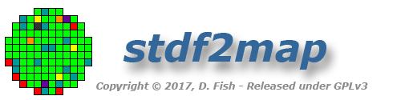
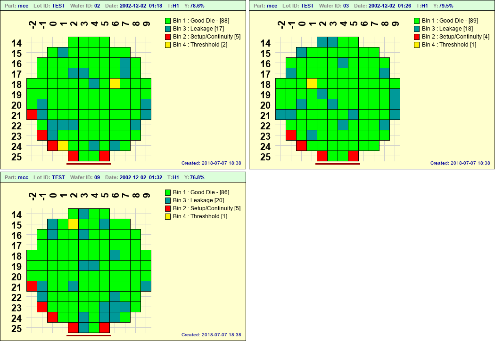

.. raw:: html

	

.. role:: redbold

Basic Usage
===========

After installation, have a look in the distribution **stdf** directory.  There are three sample files in there... I believe **lot2.stdf** and **lot3.stdf** originated from the Galaxy web site and **a595.stdf** came from a package called [RADAR] (https://sites.google.com/site/stdfradar/)   (I have other stdf files I've tested the app with, but they are proprietary and I can't distribute them) 

Run the command::

	$ stdf2map -o test a595

.. note::
	
	If you didn't copy the sample stdf files to your **stdf_path** directory during installation, you will need to **cd** into the distribution stdf directory for the above command to work.
	
The command above should provide three output files *test.png*, *test-1.png*, and *test-2.png* for wafers **02**, **03** and **09** respectively.  The images should be similar (but larger) than the following:
	

Several things to note:

	* The **.stdf** extension on input files is optional
	* The **-o** option specifies a *base* output file name.  Because *clobbermode* is set to false by default in **stdf2map.config**, names for additional maps were created automatically by appending integers to the base output name.  If you run the exact same command again, in the same directory, you will get output files *test-3.png*, *test-4.png* and *test-5.png*
	* Since the image type was not specified, **.png** was used as the default (default format is set in the **map_format** variable in the config file).  The default format can be overriden by explicitly stating the output format (i.e **stdf2map -o test.jpg a595**)
	
The title line in the wafermap is fairly self-explanatory, however the **T:H1** warrants an explanation.  

	* **T** - stands for *Test*
	* **H** - means the hardware bin (hbin) is being mapped  This would be **S** if the software bin (sbin) were being mapped.
	* **1** - indicates the First testset for this wafer (covered in more detail in :ref:`flags-label`
	
	
Now try the command::

	$stdf2map a595
	
You will get the same three maps, but this time, they will be placed in your config file **map_path** directory, and they will have very different filenames:

	* mcc_02_20021202-091854-h1.png
	* mcc_03_20021202-092610-h1.png
	* mcc_09_20021202-093226-h1.png

File Globbing
-------------
You can create multiple maps at once using file globbing. In the distribution **stdf** directory, try the command::

	$stdf2map *.stdf
	
and you should get several maps in your **map_path** directory.  Some will be duplicates of the ones you just created above and some will have different colors.  (We will get to the reason why the colors are different when we cover optional config files.)

Some linux distributions support the **globstar** feature ( enabled with **'shopt -s globstar'** ) which can be very useful for recursively generating maps from stdf files in multiple subdirectory levels.  
For example, assume your stdf directory is **/home/user/stdf/** and you have stdf files in multiple subdirectories by *part/tester/lot*.  You can create maps for all of the stdf files with the simple command **stdf2map /home/user/stdf/\*\*/*.stdf** 

 
Automatic File Naming
---------------------	
Since you *can* create gobs of maps using file globbing, output file names need to be unique and that is controlled by the **auto_filename** format string in the config file.  The default is::

	auto_filename = "%prefix%part_%waferid_%tshum-%binmap%testset%suffix%thumbstr"
	
but you have **lots** of different options when it comes to constructing the auto-generated naming method.  Here's a excerpt of comments from the **stdf2map.config** file::

	# Auto-generated filename format (i.e no -o option on command line)
	#---------------------
	# Valid Keywords are:
	#---------------------
	# %part - Part ID
	# %lotid - Wafer lotid 
	# %waferid - Wafer ID 
	# %nowhex - Current unix time in hex
	# %nowdec - Current unix time in decimal
	# %nowhum - Current human readable gmtime (Ymd-HMS)
	# %tshex - Test datetime unix time in hex
	# %tsdec - Test datetime unix time in decimal
	# %tshum - Test datetime - Human readable gmtime (Ymd-HMS)
	# %testset - Test number as specified with -t command line option
	# %binmap - "Will be either H for HBIN or S for SBIN"
	# %prefix - User specified string (see below)
	# %suffix - User specified string (see below)
	# %thumbstr - ONLY inserted if thumb_mode = True (see below)
	
.. note::

	The default **auto_filename** format string will put **ALL** maps in the same output directory.  Probably not an ideal situation for thousands of maps... it may be preferable to have output maps in subdirectories by part and lotid, thus give some attention to the following comments and experiment with what works best for you.
	
more **auto_filename** comments::
	
	#---------------------
	# Note that string literals remain unchanged, thus if you wanted  
	# a fab number for example, at the beginning of all your files you could use
	# something like: "FAB1_%part_waferid_...etc" 
	# You can also use path separators appropriate to your system
	# (use \ on Windows) to create a directory structure. 
	# For example, the following would put maps in sub-directories by part and lotid
	# ( sub-directories are automatically created if they don't exist )
	# auto_filename = '%prefix%part\%lotid\%waferid_%binmap%testset%suffix%thumbstr'
	 
	auto_filename = "%prefix%part_%waferid_%tshum-%binmap%testset%suffix%thumbstr"
	
	# If "clobbermode" = True, output files of the same name will be overwritten,
	# if False, a "dash-number" will be appended just preceding the file type until
	# a unique file name is obtained (i.e file-1, file-2, file-3 .... file-n)

	clobbermode = false
	  
	# Prefix and suffix are arbitrary user-defined strings that are provided
	# primarily as a means of customizing the filename from within config files
	# They can be placed anywhere in the format string, they don't necessarily 
	# need to go at the beginning or end.
	 
	prefix = ""
	suffix = ""
	 
	# Thumb_mode should ALWAYS be false in the main configuration file.
	# It is provided as a means of enabling thumbnail mode from a user 
	# configuration file.  The ONLY effect thumb_mode has is the automatic
	# insertion of "thumbstr" in the output filename (assuming 'auto_filename'
	# contains the %thumbstr keyword)  
	 
	thumb_mode = false
	thumbstr = "_thumb"
	 
	# Automatically translate case in the output filename. Valid values are:
	# 'upper','lower','capitalize' (Only capitalizes the first letter)
	# If it is commented out, no case changing will be performed 
	auto_translate = 'lower'
 
 
There are a number of options you can tweak in the config file.  Most of them should be fairly intuitive, the ones that aren't I've tried to clarify with comments.  Some of them can be superseded via command line options, discussed in the next section.