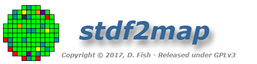
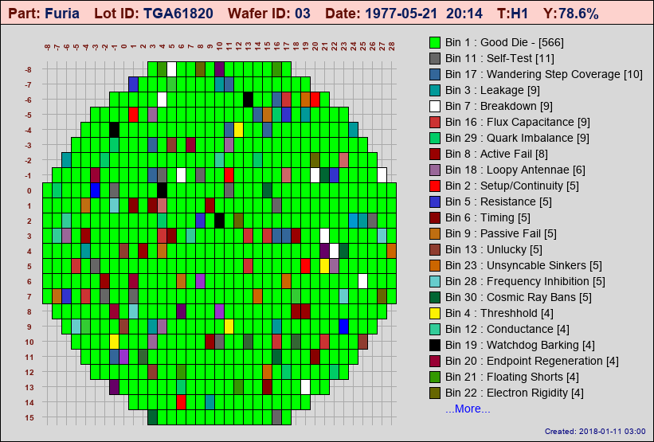
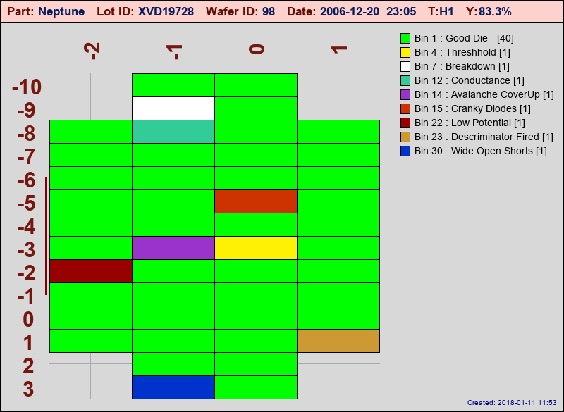
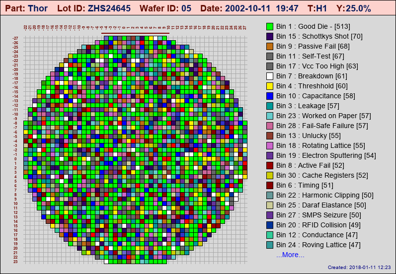
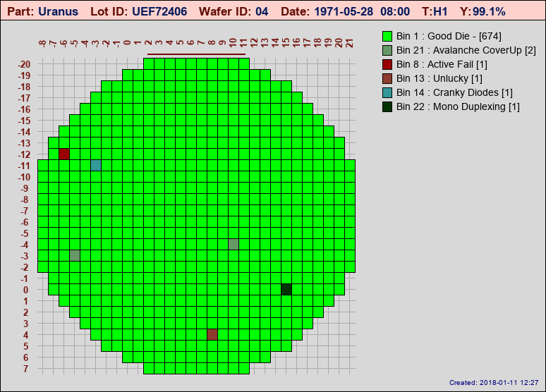
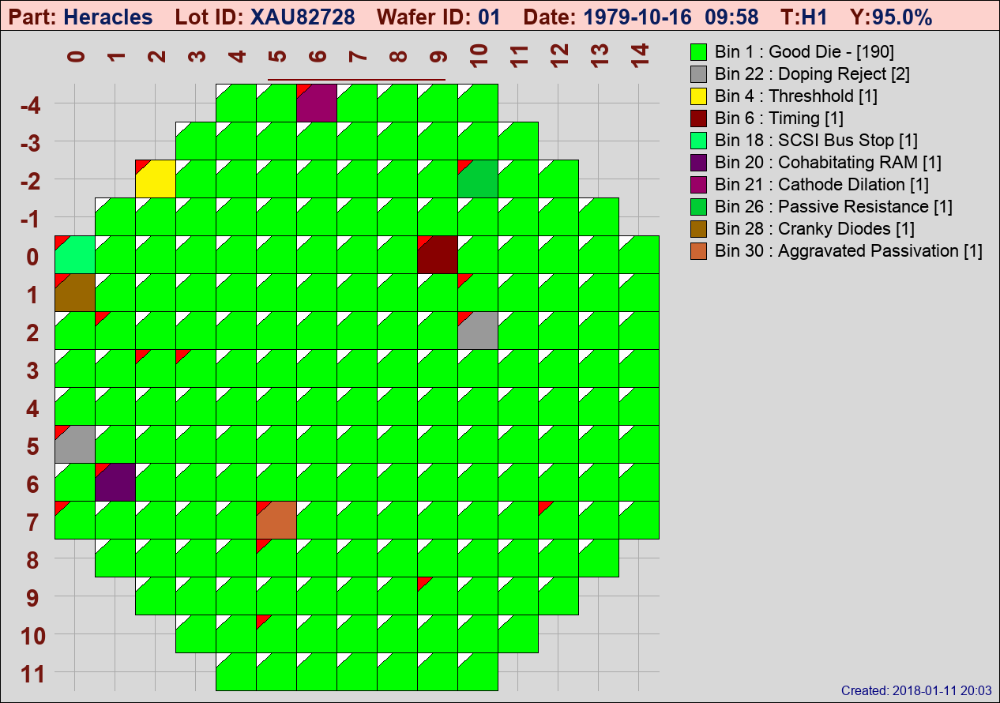
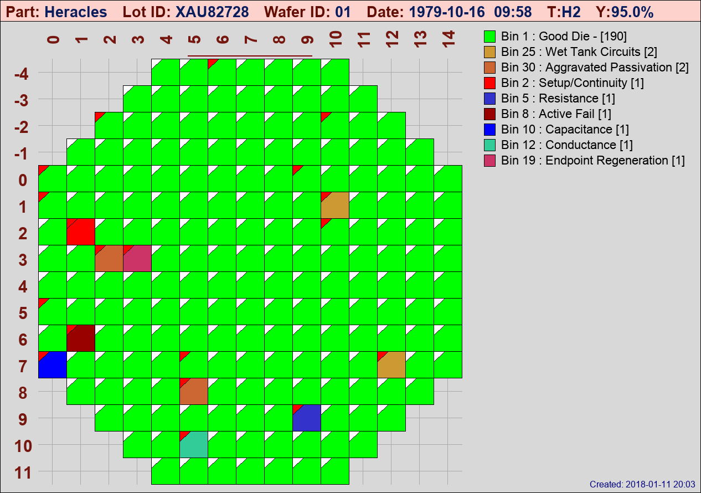

.. _demo-label:

Demo Mode
=========

**stdf2map** has a built-in demo mode that can make some pretty realistic looking wafer maps.  It was originally added specifically to test some 
features that proved hard to test due to the lack of a large variety of STDF files

The following entries in **stdf2map.config** control demo mode settings::

	# --------------- Demo Section Group ---------------------
	[demo]
	# random_diecount = true will create maps with a random
	# number of rows & columns. (within min/max limts)  
	# ALL WAFERS in lot will have the same counts
	 
	random_diecount=true

	# Same as above EXCEPT ALL WAFERS within a lot will have
	# random diecounts. 

	random_diecount_eachwafer = true

	# If BOTH the above are false, Demo map will always have 
	# row & col counts specified by the min/max values.

	min_X=-30
	max_X=30
	min_Y=-30
	max_Y=30
	 
	# Minimum and Maximum Bin numbers to use.  ONLY valid for Demo
	minbin=1
	maxbin=30
	 
	# Default number of test sets in the demo map, this would 
	# typically be changed by using the -t option with -d 
	# (In demo mode -t SETS the number of testcounts) 
	 
	testcount=1
	 
	# Specify percentage of die that will have "good_die_bin" number
	# Floating point or integer number is fine
	# Internally limited between  0.0 and 100.0, numbers outside that
	# range will be set to the nearest limit.
	# Can also change this with the -g command line option.

	good_die_percent = 78.6

Demo mode is invoked with the **-d** option and requires a numeric value, i.e.::

	$ stdf2map -d1 -v

The numeric value indicates the number of wafers in the lot and can range from 1-99.

I got something like this... you will get something completely different.  In fact you will get something completely different every time you run the demo. Nearly everything is generated randomly (or randomly picked from lists), Part, Lot ID, Wafer ID, Number of die, Bin failures, Bin Labels (I actually had a lot of fun just coming up with a list of random Bin labels...)

Next time you run the demo you might get something that looks like:

And believe it or not, I've actually seen some real wafers that pretty much look like that...

The number of good/bad die can be controlled by the **good_die_percentage** value in the **[demo]** section of the config file (or by using the **-g** command-line option).  You can make some really ugly maps if you want (or maybe realistic ones depending on your process!  Argh! Been there... done that).  Prank your boss... .*".. uh hey boss, here are some of the latest wafer maps.."* On second thought... maybe not such a good idea!

Or instantly improve your process... (okay, forget you heard that! - I DID NOT SAY THAT!)

Special Config File
-------------------

There is a special demo mode config file **conf/demomap.toml** that will be automatically applied to demo maps **ONLY** if it exists.  The file is optional as the standard **stdf2map.config** file contains necessary default entries, but it is a handy place to change the automatic file naming scheme or to redirect demo maps into a separate directory.  In our case, we also changed the map background color to a light grey for instant visual recognition we are looking at a demo map.

Sample demomap.toml file::

	# Sample demomap config file

	[image]
	bgcolor='#D8D8D8'
	basewidth=500
	baseheight=500

	[axis]
	color = '#75160F'
	grid = true
	gridcolor='#AAAAAA'

	[title]
	bgcolor='#FDD2CD'
	key_color = "#620E04"
	value_color ="#091D5D"

	[legend]
	sort_bins_by_count=true

	[file]
	# set map_path and auto_filename to redirect all demo maps to specific directory
	map_path = 'E:\WmapDemo\DemoMap'
	auto_filename = "%part_%lotid_%waferid_%binmap%testnum%thumbstr"

Demo Test Sets
---------------
You can create demo wafers with multiple test sets as well.  In normal operation, the **-t** option is used to map a specific test set from wafers in an STDF file.  In Demo mode, the **-t** option takes on a different meaning and actually SETS the number of test sets the demo routine creates in the data, which can be used to test the flagging routines

For example::

	$ stdf2map -d1 -t2
	
.. note::

	When multiple test sets are created in demo mode, it is assumed **ALL** die have been retested, not just failing die
	

