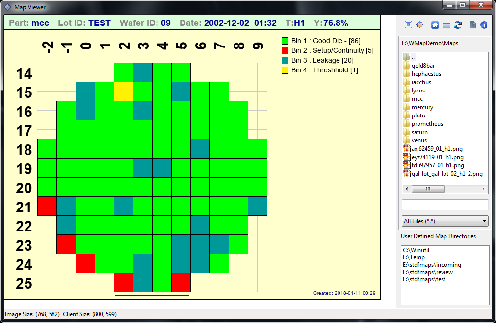
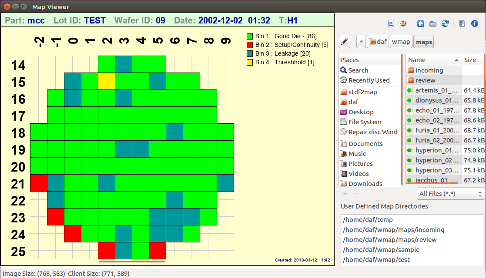
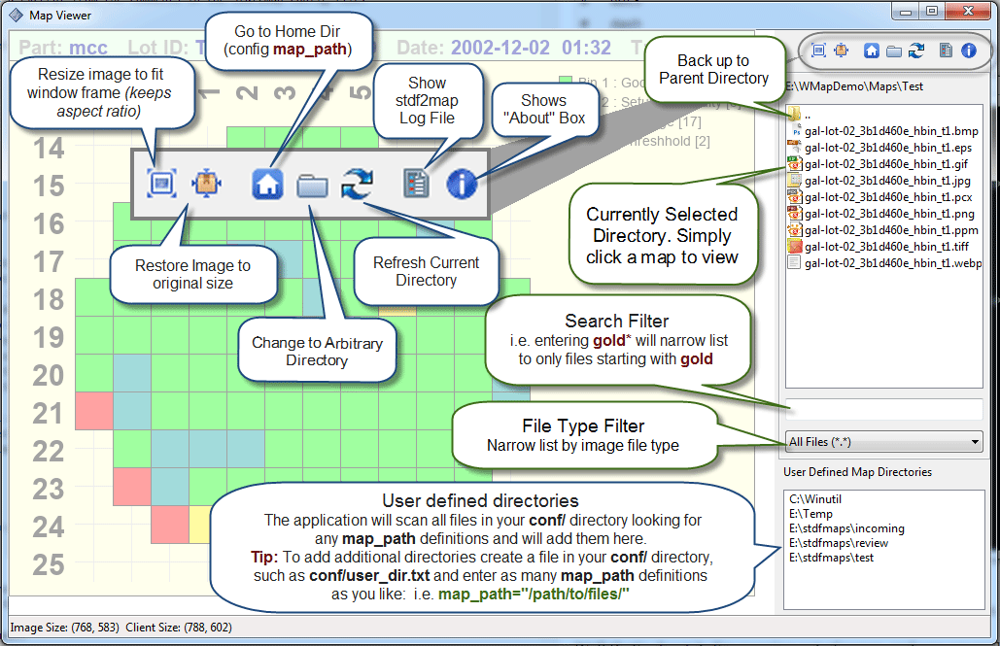

.. image:: images/pageheader.png   

.. raw:: html

	

.. role:: bluebold

.. _viewer-label:

Built-in Viewer
===============

stdf2map contains a wxPython based built-in mapviewer. It's a simple viewer, but it can be made aware of all your map directories, so you can move around and look at maps very quickly. 

The first time you run it, it will save some settings in **conf/mapviewer.config** (window location, size, current directory, splitter position, etc) 

To launch the viewer, simply include the **-v** option on the command line, i.e.::

	$ stdf2map -v a595

.. note:: 
	
	You can run the viewer in standalone mode without creating a map simply by using **stdf2map -v**.  In fact, you may want to create an alias for just that purpose (i.e. in linux bash shell **alias mapviewer="stdf2map -v"**)

|
	
:bluebold:`Windows Screenshot`

|

.. note:: 

	Launching the viewer after map creation is a modal event. 
	
	If you are processing several files at once, it will stop after the first one, show the map, and wait for you to close the window before proceeding to the next file.
	
|	
	
It looks a little bit different between Windows (above) and Linux (below).  

:bluebold:`Linux Screenshot`

|
	
Hopefully the viewer is intuitive enough that instructions aren't really needed, but here's an annotated version for the sake of completeness.

.
