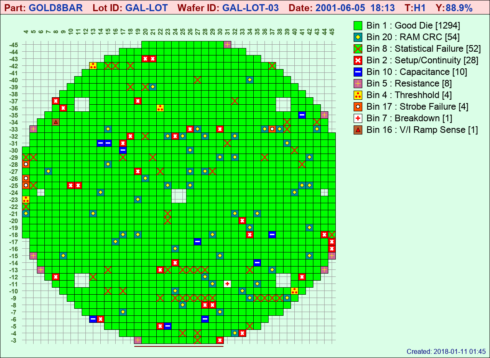
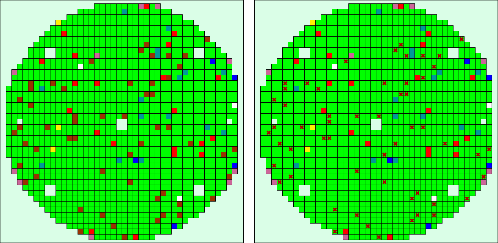

.. image:: images/pageheader.png

.. _symbol-label:

Symbols
=======

Symbols are somewhat of an experimental option... I say *experimental* not so much because they make the program less stable, but rather to use them, you may need to do some **experimenting** to see how they work best for you.  It's probably easier to understand them through an example than to try and explain them first.  So go ahead and do::    

	$ stdf2map -c symbols -vf lot3

And you should get:

and then to understand where the symbols come from, have a look at the **symbols.toml** file in your **conf/** directory::

	[bin]
	1 = {color='#00FF00', label='Good Die'}
	2 = {color='#FF0000', label='Setup/Continuity', symbol='cross', shade='#FFFFFF', scale=0.75, width=3}
	3 = {color='#009999', label='Leakage', symbol='dot', shade='#FFFFFF', scale=0.5}
	4 = {color='#FEF102', label='Threshhold', symbol='dot3', shade='#FF0000', scale=0.25}
	5 = {color='#CC6699', label='Resistance', symbol='plus', shade='#ffff00', scale=0.6}
	7 = {color='#FFFFFF', label='Breakdown', symbol='plus', shade='#FF0000', scale=0.5, width=3 }
	8 = {color='#00FF00', label='Statistical Failure', symbol='cross', shade='#ff0000', scale=1.0, width=2}
	10 = {color='#0000FF', label='Capacitance', symbol='dash', shade='#FFFFFF', scale=0.65, width=3}
	16 = {color='#BF6030', label='V/I Ramp Sense', symbol='square', shade='#000000', scale=0.5 }
	17 = {color='#FF5500', label='Strobe Failure', symbol='dot', shade='#ffffff', scale=0.5, outline='#000000'}
	20 = {color='#009999', label='RAM CRC', symbol='diamond', shade='#ffff00', scale=0.6, outline='#000000' }

Symbols can be used to very quickly **grab your attention** when you are scanning though a bunch of wafermaps.  Perhaps you have some **critical bins** that are easy to miss on a standard wafermap, or some that rarely fail but you **really** want to be alerted if they do... or maybe a recent process issue that you want to monitor more closely...  There are lots of good uses for them, but let me give you a real-life example of just how they came to be. 

When I worked in the industry, our wafers went through a *Statistical Software Test* after the functional hardware ATE test.  The statistical test would often mark additional die bad (ones that had passed functional hardware testing).  These were marked bad for a variety of reasons... statistical outlier, good die in bad neighborhood, drift analysis, or other factors that had proven to cause higher than usual burn-in or hybrid fallout. The statistically marked die were given special Bin numbers and the data was merged back with the original test data before dicing and picking.

Test & Device Engineers were constantly looking at wafermaps and other compiled data to monitor the effectiveness of both the Hardware and Statistical Software Testing, but visual recognition between hardware and software bin failures on a wafermap full of colored squares gave them headaches, so I came up with a solution they instantly liked.  *Set the background color of statistical bin failures to be that of "good die" and mark them with a special symbol.*  (After all, they **were** "good die" electrically, they were simply being rejected for statistical reasons.)

Applying that principle here, assume all the dark brown bins on the below left map on are *Statistical Software Failures*.
Using symbols on the below right, it instantly becomes **visually apparent** which die were statistical failures vs. those that failed electrical testing...  and this was just one statistical failure bin.  It becomes even more apparent when multiple bins and symbols are involved.

For more info on how to use symbols, I'll just include an excerpt from the comments in the **stdf2map.config** file::

	# For each bin listed, color and label MUST be specified
	# although label can be blank (as in label='').  
	# Symbol is optional and valid symbols are:
	#   dot
	#   dot3
	#   dash
	#   plus
	#   square
	#   diamond
	#   triangle
	#   cross
	#
	# Symbol modifiers are also optional as defaults are used, but 
	# in most cases the defaults won't look very well as it's impossible 
	# to have a "one-size fits all" default that works for all calculated
	# die sizes.  Valid modifiers are:
	#   shade - synonymous with "color", but applies to the symbol
	#   scale - the size of the symbol, in general, you can think of this as:
	#         "if you draw a square around the symbol, it's the percentage of
	#         die space it will take up"
	#   width - line width in pixels - applies only to symbols drawn with lines 
	#         (cross, dash, plus). Because the image routines do not support 
	#         anti-aliasing, "width" often looks best with odd numbers (1, 3, 5, etc.)
	#   outline - 1-pixel outline color, applies only to symbols that get a
	#         color fill (dot, dot3, square, diamond, triangle).  Not for small die...
	#
	# Symbols in general will not work very with small die, experimentation is the 
	# best way to get a look you are after for any specific die size. (However, you 
	# can always increase the apparent die size by making the image bigger :-) 
